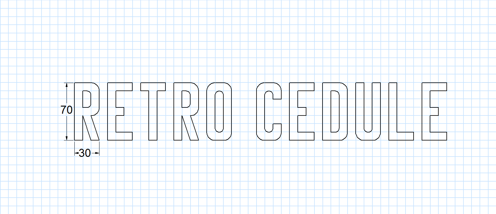
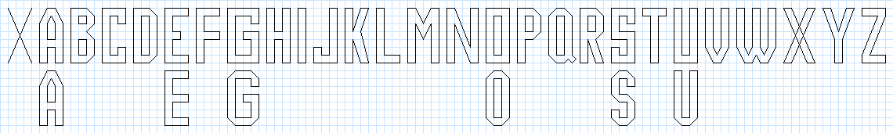

# RETRO CEDULE FONT

*My attempt to recreate font from old Czechoslovak enamel signs.*

Before advent of modern computer-based typesetting these signs were made using font hand crafted templates. In former Czechoslovakia these signs have one very specific font. 

Font designer Ondrej Jób went into this rabbit hole and discovered [how these signs were designed](https://www.setuptype.com/blog/manual) ([he described it in Slovak too](https://www.setuptype.com/sk/blog/manual)). He (re)created family of fonts called [Manual](https://www.setuptype.com/manual) (Grotesk, POZOR, Tatry and Korytnica) which recreates these oldschool fonts for modern typesetting.

I find his project very interesting and I wanted to recreate something similar so this is my attempt to do so.

## status

- rough draft of all letters
- still needs more work (how to make good looking B and Q?)
- tooling needs to be improved
- **not yet usable in real life**

## workflow

1. gather some reference material (photos of old Czechoslovak enamel signs)
2. draw some letters in DeltaCAD and/or [CadZinho](https://github.com/zecruel/CadZinho)
3. convert it with my own scripts (provided in this repo) to SVG and/or UFO font files
4. convert it to TTF/OTF
5. profit?

There is single `fontgen.php` file provided which can be used with PHP 7+. Use it from command line as `php fontgen.php --help`. All dependencies are included in this repo, you dont need to install anything.

Or use [FontStruct](https://fontstruct.com/) to assemble this font. I am probably going this way from now.

## licenses

- everything in `glyphs` dir (and all derived font files are under SIL license)
- everything else (especially code but also documentation) is under MIT license
- original fonts enamel signs which I am trying to recreate were designed by anonymous workers based on Richard Pípal work, I have no rights to those
